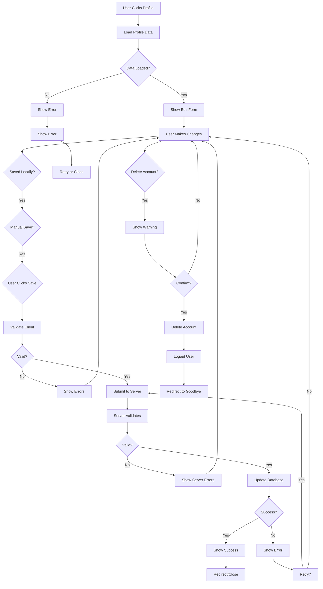
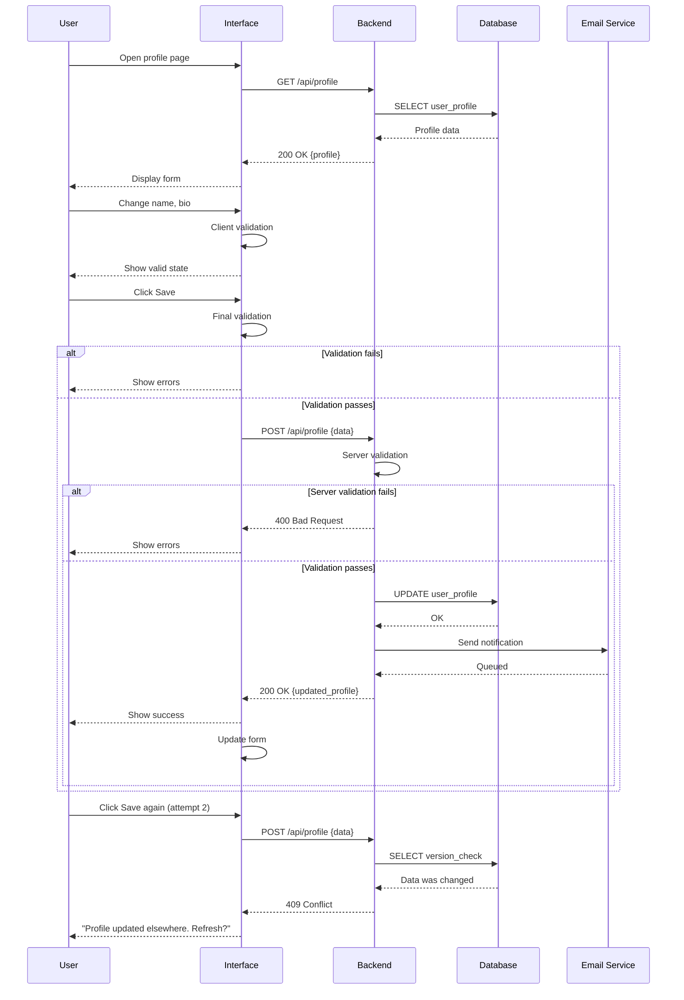
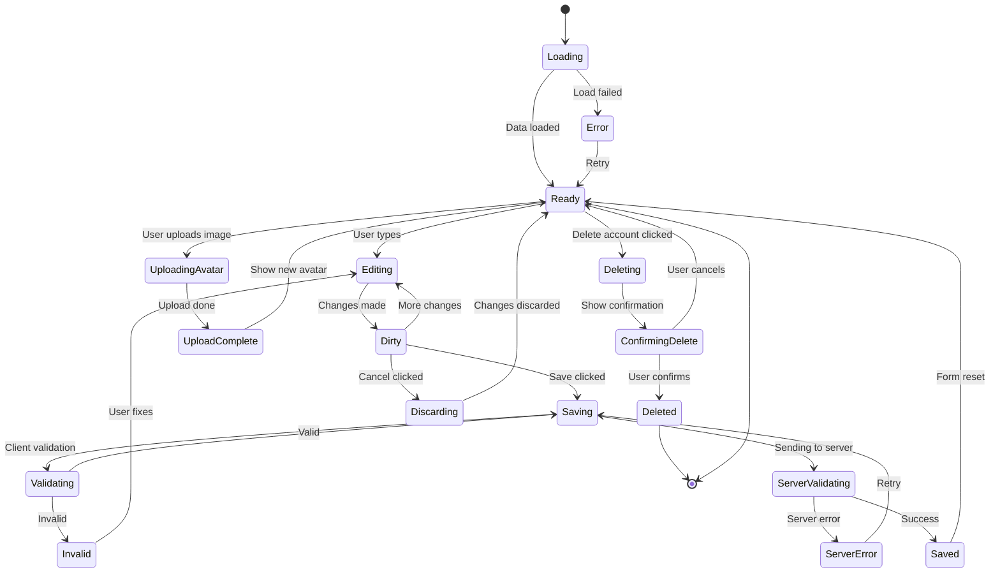

# Complete Design Review Example

This example shows a complete design review with all components: questions, diagrams, behavior documentation, and error handling.

## Design Under Review: User Profile Editor

### ASCII Design

```
┌────────────────────────────────────────┐
│ ★ MyApp              Settings    👤    │
└────────────────────────────────────────┘

┌────────────────────────────────────────┐
│ Edit Profile                           │
│ ──────────────────────────────────     │
│                                        │
│ Avatar                                 │
│ [Image] [Change]                       │
│                                        │
│ Full Name *                            │
│ [John Doe_____________]                │
│                                        │
│ Email *                                │
│ [john@example.com_____]                │
│                                        │
│ Bio                                    │
│ [Designer and developer______         │
│  ________________________]              │
│                                        │
│ Website                                │
│ [https://johndoe.com_________]         │
│                                        │
│ Visibility                             │
│ ○ Public  ● Private                    │
│                                        │
│ [Save] [Cancel] [Delete Account]      │
│                                        │
└────────────────────────────────────────┘
```

---

## CRITICAL QUESTIONS

### About Users & Context
1. **Who is editing their profile?** Only themselves or admins too?
2. **What devices?** Desktop, mobile, or both? Any browser constraints?
3. **Permissions?** Can users change email? Can they delete?
4. **Workflow?** Is this modal dialog or full page?

### About Features
5. **Avatar upload?** What formats? Size limits? Automatic resize?
6. **Bio field?** Max length? Markdown support? @ mentions?
7. **Visibility toggle?** Instant effect or needs save?
8. **Delete account?** Irreversible? Confirmation needed? Backup?

### About Data
9. **Name validation?** Any characters allowed? Length limits?
10. **Email change?** Confirmation required? Notify old email?
11. **Website field?** URL validation? Link verification?
12. **Concurrent edits?** What if user edits on 2 devices?

### About Errors
13. **Email already taken?** How to handle? Suggest alternatives?
14. **Upload fails?** Retry strategy? Show error? Fallback?
15. **Network interruption?** Save draft? Queue for later?
16. **Session expires?** During edit? Save/lose changes?

### About Success
17. **What confirms save?** Message? Redirect? Toast notification?
18. **Auto-save?** Or manual save only?
19. **Change notifications?** Email user about changes?
20. **Account deletion?** Send confirmation? Notification?

---

## USER JOURNEY FLOWCHART



---

## SEQUENCE DIAGRAM: Complete Update Flow



---

## STATE CHART: Profile Editor States



---

## STEP-BY-STEP BEHAVIOR DOCUMENTATION

### STEP 1: Load Profile Page

```
WHEN: User navigates to /profile
```

**USER SEES:**
- Loading spinner
- "Loading your profile..."
- (Except avatar, name - might show cached)

**BACKEND:**
```
GET /api/profile
Authorization: Bearer [token]
Response: {
  user_id: 123,
  name: "John Doe",
  email: "john@example.com",
  bio: "Designer",
  website: "https://johndoe.com",
  visibility: "private",
  avatar_url: "https://cdn.example.com/avatar_123.jpg",
  created_at: "2024-01-01",
  updated_at: "2024-01-15"
}
```

**VALIDATIONS:**
- User must be authenticated (token valid)
- User must have permission (own profile or admin)
- Profile must exist

**TIMING:**
- Expected: < 500ms
- Acceptable: < 2s
- Timeout: 30s

**ERRORS:**
- 401 Unauthorized → Redirect to login
- 403 Forbidden → "You don't have access"
- 404 Not Found → "Profile not found"
- 500 Server Error → "Something went wrong"

**SUCCESS TRANSITION:**
- Form populated with data
- Fields enabled
- Save button enabled
- Cancel button enabled


### STEP 2: Edit Fields

```
WHEN: User types in any field
```

**CLIENT-SIDE VALIDATION (Real-time):**

Full Name:
- ✓ Min 2 chars
- ✓ Max 100 chars
- ✓ No leading/trailing spaces
- Status: Shows as user types

Email:
- ✓ Valid format (regex)
- ✓ Max 254 chars
- Status: Shows as user types (not unique check yet)

Bio:
- ✓ Max 500 chars
- ✓ Remaining chars shown: "250 / 500"
- Status: Warn when > 400

Website:
- ✓ Valid URL format
- ✓ Starts with http/https
- Status: Shows as user types

Visibility:
- ○ Public / ● Private
- Can toggle anytime

Avatar:
- Upload when "Change" clicked

**USER SEES:**
- Real-time feedback on each field
- ✓ Green check when valid
- ✗ Red error when invalid
- Character count on bio

**NOT VALIDATED YET:**
- Email uniqueness (server only)
- Website URL still exists
- Permissions

**DIRTY STATE:**
- Form marked as modified
- "Unsaved changes" indicator appears
- Cancel button shows: "Discard changes"


### STEP 3: Avatar Upload

```
WHEN: User clicks "Change" button
```

**FILE DIALOG OPENS:**
- Accepts: .jpg, .jpeg, .png, .gif, .webp
- Max size: 5MB
- Shows preview of selection

**UPLOAD PROCESS:**
1. User selects file
2. Show preview
3. Client validation:
   - File size < 5MB
   - File type correct
   - Show error if invalid
4. If valid, upload starts
5. Show progress bar
6. Show "X% uploaded"

**BACKEND:**
```
POST /api/profile/avatar
Content-Type: multipart/form-data
Authorization: Bearer [token]

Processing:
1. Validate file
2. Virus scan (async)
3. Resize to 200x200px
4. Crop to center
5. Convert to webp
6. Upload to CDN
7. Update database user.avatar_url
8. Delete old avatar from CDN
```

**USER SEES AFTER:**
- New avatar displays immediately (local)
- Old avatar shows with spinner
- When upload completes: "✓ Avatar updated"
- If fails: "Upload failed - try again"

**ERRORS:**
- File too large: "File exceeds 5MB. Size: 12MB"
- Wrong type: "Only JPG, PNG, GIF allowed"
- Upload failed: "Network error. Try again"
- Virus detected: "File rejected for security"


### STEP 4: Save Changes

```
WHEN: User clicks "Save" button
```

**CLIENT VALIDATION (Blocking):**
```
✓ Name not empty
✓ Name 2-100 chars
✓ Email format valid
✓ Email not empty
✓ Bio ≤ 500 chars
✓ Website URL valid (if provided)
```

**IF VALIDATION FAILS:**
- Button remains enabled
- Show inline errors
- Highlight invalid fields
- Focus on first invalid field
- User must fix and retry

**IF VALIDATION PASSES:**
- Disable Save button
- Show spinner: "Saving..."
- Disable Cancel button
- Disable all form fields

**SEND TO SERVER:**
```
POST /api/profile
Authorization: Bearer [token]
Content-Type: application/json

{
  "name": "John Doe",
  "email": "john.doe@example.com",
  "bio": "Designer and developer",
  "website": "https://johndoe.com",
  "visibility": "private"
}
```

**SERVER VALIDATION:**
```
✓ User authenticated
✓ User authorized (own profile)
✓ All fields present
✓ Name format valid
✓ Email format valid
✓ Email not already taken (by another user)
✓ Website URL responds (optional)
✓ Profile version hasn't changed
```

**DATABASE UPDATE:**
```
UPDATE users 
SET 
  name = 'John Doe',
  email = 'john.doe@example.com',
  bio = 'Designer and developer',
  website = 'https://johndoe.com',
  visibility = 'private',
  updated_at = NOW(),
  version = version + 1
WHERE user_id = 123
  AND version = 42  -- Optimistic locking
```

**SIDE EFFECTS:**
- Send confirmation email: "Your profile was updated"
- Log action: user_id, timestamp, fields changed
- Clear cache for this profile
- Invalidate CDN cache for avatar

**TIMING:**
- Validation: < 100ms
- Server processing: < 500ms
- Email: 2-5s (async)
- Total user: < 1s


### STEP 5: Save Success

```
WHEN: Server returns 200 OK
```

**BACKEND RESPONSE:**
```json
{
  "success": true,
  "message": "Profile updated",
  "profile": {
    "user_id": 123,
    "name": "John Doe",
    "email": "john.doe@example.com",
    "bio": "Designer and developer",
    "website": "https://johndoe.com",
    "visibility": "private",
    "avatar_url": "https://cdn.example.com/avatar_123_v2.jpg",
    "updated_at": "2024-01-20T10:30:00Z"
  }
}
```

**USER SEES:**
- Save button disabled briefly
- Spinner disappears
- ✓ Toast notification: "Profile saved successfully"
- Form data refreshed
- Dirty state cleared
- Cancel button shows: "Cancel" again
- All fields enabled

**NEXT ACTIONS:**
- User can edit again
- User can navigate away
- Toast disappears after 3s


### STEP 6: Delete Account

```
WHEN: User clicks "Delete Account" button
```

**CONFIRMATION DIALOG SHOWS:**
```
⚠️ Delete Account?

This action cannot be undone.

Your data will be permanently deleted:
- Profile information
- Messages
- Posts
- All settings

Type "DELETE" to confirm:
[DELETE______________]

[Cancel] [Delete Account]
```

**VALIDATIONS:**
- User must type exact word: "DELETE"
- User must be authenticated
- Account must not have pending actions
- Account must not have active subscriptions

**IF CONFIRMED:**
```
POST /api/profile/delete
Authorization: Bearer [token]
Body: { "confirm": true }
```

**BACKEND PROCESS:**
1. Verify user identity (challenge-response)
2. Create backup of user data (archive)
3. Mark account for deletion (30-day grace period)
4. Send confirmation email: "Your account deletion has started"
5. Disable login (account inactive)
6. Return data in email (if requested)
7. After 30 days: Permanently delete

**USER SEES:**
- Logged out immediately
- Redirected to goodbye page
- "Your account has been scheduled for deletion"
- "You have 30 days to cancel"
- Confirmation email sent

**30-DAY GRACE PERIOD:**
- User can login with "Restore" link in email
- Data still exists but account inactive
- After 30 days: Complete deletion
- Cannot restore after permanent deletion


### STEP 7: Discard Changes

```
WHEN: User clicks "Cancel" / "Discard"
```

**IF NO CHANGES:**
- Just close/navigate

**IF CHANGES:**
- Show dialog: "Discard unsaved changes?"
- [Keep Editing] [Discard]

**IF DISCARD:**
- Form reverts to last saved state
- Dirty state cleared
- Avatar upload (if pending) cancelled
- Return to ready state


---

## ERROR HANDLING DETAILS

### ERROR: Email Already Taken

```
SCENARIO: User changes email to already-used one
DETECTION: Server validation fails
HTTP: 400 Bad Request
Response: {
  "error": "DUPLICATE_EMAIL",
  "message": "Email already in use",
  "field": "email"
}
```

**USER SEES:**
- Save button enabled
- Red error below email field: "This email is already in use"
- Email field highlighted
- Focus moved to email field
- Form data preserved
- Other fields remain valid

**RECOVERY:**
- User can change to different email
- User can choose "Keep original email"
- Retry save

**PREVENTION:**
- Real-time uniqueness check after 1 second delay
- Shows: "✓ Email available" or "✗ Email taken"
- Suggests alternatives


### ERROR: Network Timeout

```
SCENARIO: Server takes >30s to respond
DETECTION: Request timeout
```

**USER SEES:**
- After 10s: "Saving..."
- After 20s: "Still saving... This is taking longer than usual"
- After 30s: Error appears

**ERROR SHOWN:**
- "Save operation timed out"
- "Check your connection and try again"
- [Retry] [Discard] [Keep Trying]

**IF RETRY:**
- Resend same request
- Fresh attempt

**IF KEEP TRYING:**
- Wait 60 more seconds
- Auto-retry once

**IF DISCARD:**
- Lose changes
- Return to previous state

**BACKEND:**
- If original request was successful (arrived late):
  - Data already saved
  - Return 200 OK on retry
  - Show: "Changes were saved"


### ERROR: Concurrent Modification

```
SCENARIO: 
- User A viewing profile
- User B changes profile
- User A tries to save old version

DETECTION: Version mismatch
HTTP: 409 Conflict
Response: {
  "error": "CONFLICT",
  "message": "Profile has been updated",
  "current_version": 43,
  "your_version": 42,
  "conflicting_fields": ["name", "bio"]
}
```

**USER SEES:**
```
⚠️ Profile Updated
Your profile was modified by another session/device.

Your changes:
  Name: [New Name]
  Bio: [New Bio]

Their changes:
  Name: [Different Name]

You can:
[Keep Your Changes] [View Their Changes] [Start Over]
```

**IF KEEP YOUR CHANGES:**
- Overwrite their changes
- Loss of their data
- Show warning: "You will overwrite their changes"
- Require explicit confirmation

**IF VIEW THEIR CHANGES:**
- Close editor
- Reload page with new data
- Show: "Profile reloaded"
- User can start over

**IF START OVER:**
- Reload page
- Form shows current state
- User can choose what to do

**PREVENTION:**
- Show: "Last updated by you on..."
- Show: "...or by another session"
- Warn if stale > 5 minutes


### ERROR: Missing Required Fields

```
SCENARIO: User tries to save without name
DETECTION: Client validation
```

**CLIENT ERROR (Before submit):**
- Name field has red border
- Error message: "Name is required"
- Form field shows: "Required"
- Save button disabled until fixed

**BACKUP - SERVER VALIDATION:**
If someone bypasses client validation
- Server returns: 400 Bad Request
- Lists all missing fields
- User must fix

**NEVER:**
- Save incomplete data
- Accept form without required fields
- Silently default values


### ERROR: Server Error 500

```
SCENARIO: Unexpected server error
DETECTION: 500 Internal Server Error
Response: {
  "error": "INTERNAL_SERVER_ERROR",
  "message": "An unexpected error occurred",
  "request_id": "req_abc123xyz"
}
```

**USER SEES:**
- "An error occurred. Please try again."
- Request ID: "req_abc123xyz" (for support)
- [Retry] [Discard] [Contact Support]

**BACKEND:**
- Error logged with request ID
- Stack trace captured
- Ops team alerted (if critical)
- Incident tracking created

**USER RETRY:**
- Full form data preserved
- Can retry immediately
- Or try again later
- Error should resolve when backend fixed

**SUPPORT:**
- User can reference request ID
- Support team looks up what happened
- Can manually sync data if needed


---

## ACCESSIBILITY CONSIDERATIONS

```
KEYBOARD NAVIGATION:
- Tab: Move between fields
- Tab + Shift: Move backward
- Enter: Submit form
- Escape: Cancel

SCREEN READER:
- Form labeled: "Edit Profile"
- Each field has <label>
- Required fields marked: "* required"
- Error messages associated with inputs
- Success message announced
- Loading state announced

VISUAL:
- Color contrast ≥ 4.5:1
- Error text red + icon
- Valid state green + icon
- Focus visible (blue outline)
- Large enough touch targets (44px)

COGNITIVE:
- Clear, simple language
- Grouped related fields
- Clear error messages
- Show what's required upfront
- Progressive disclosure
```

---

## MOBILE CONSIDERATIONS

```
LAYOUT:
- Full width: 100vw
- Single column
- Touch-friendly buttons: 44x44px
- Field height: 48px
- Readable font: 16px minimum

INTERACTIONS:
- Avatar tap to upload
- Keyboard appears for text input
- Save button always visible (sticky if needed)
- Confirmation dialogs scrollable

PERFORMANCE:
- Initial load: < 3s
- Field interaction: instant feedback
- Save: 1-2s
- Error display: instant
```

---

## IMPLEMENTATION CHECKLIST

Before moving to code:

✓ All questions answered
✓ All user paths mapped
✓ All error scenarios covered
✓ All states documented
✓ Data flow clear
✓ APIs defined
✓ Database schema designed
✓ Validation rules finalized
✓ Error messages written
✓ Success criteria defined
✓ Team alignment achieved
✓ Design approved by stakeholders

---

**This complete review is ready for Phase 2 (Implementation).**
