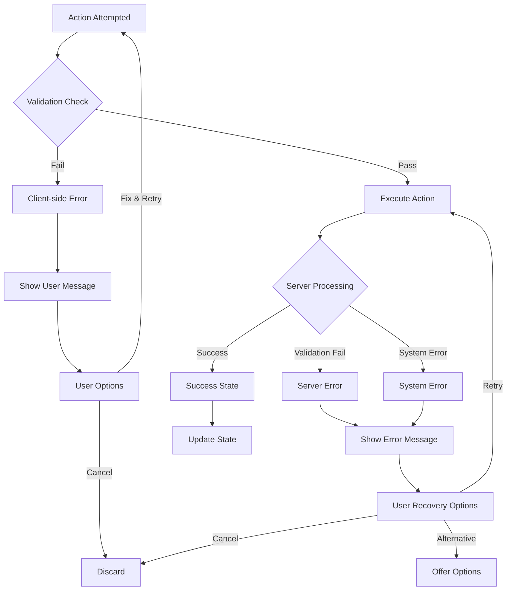

# Error Handling Strategies Reference

This reference documents common error scenarios, detection strategies, recovery paths, and prevention techniques.

## Error Categories

### 1. Validation Errors (User Input)
**What**: User enters invalid data
**Examples**: Bad email format, too short password, invalid date

### 2. Authentication Errors
**What**: User identity cannot be verified
**Examples**: Wrong credentials, token expired, permission denied

### 3. Data Errors
**What**: Data is missing, corrupted, or inconsistent
**Examples**: Record not found, concurrent modification, data mismatch

### 4. System Errors
**What**: System or backend failure
**Examples**: Database down, server error, timeout

### 5. Network Errors
**What**: Communication failure
**Examples**: No internet, request timeout, connection lost

### 6. Business Logic Errors
**What**: Operation violates business rules
**Examples**: Insufficient funds, quota exceeded, invalid state

### 7. Resource Errors
**What**: Required resource unavailable
**Examples**: File not found, storage full, API rate limited

## Error Handling Strategy Template

```
ERROR: [Error Name]
─────────────────────────────────────

CATEGORY: [Validation/Auth/Data/System/Network/Business/Resource]

WHEN IT OCCURS:
- Condition 1
- Condition 2
- Condition 3

DETECTION:
Client-side:
  - [How user action triggers it]

Server-side:
  - [Backend validation]
  - [Database check]

WHAT HAPPENS:
1. Error detected
2. Error logged
3. User notified
4. Recovery offered

USER EXPERIENCE:
Shows:
  - Clear error message
  - What went wrong
  - How to fix it
  - Next steps

Example: "[Action] failed because [reason]. [Solution]."

RECOVERY:
- Retry: [What happens]
- Cancel: [What gets undone]
- Alternative: [Other options]

PREVENTION:
- Input validation (client)
- Input masking
- Placeholder examples
- Real-time feedback
- Confirmations for risky actions

LOGGING:
- Error code: [CODE]
- Severity: [Low/Medium/High/Critical]
- What to log: [Details for debugging]

RETRY STRATEGY:
- Automatic retry: [Yes/No, how many times]
- Exponential backoff: [Yes/No]
- User retry: [How to manual retry]
- Give up: [After how many attempts]
```

## Common Error Scenarios

### Email Validation Error

```
ERROR: Invalid Email Format
─────────────────────────────

WHEN:
- User enters invalid email
- Format doesn't match pattern
- Backend validation fails

DETECTION:
Client: Regex validation instant
Server: Email verification check

USER SEES:
"Please enter a valid email address (e.g., user@example.com)"
Red highlight on field
Helper text with valid format

RECOVERY:
- Clear field
- Show correct format
- Accept on valid format

PREVENTION:
- Input masking: user@|
- Placeholder: user@example.com
- Real-time validation feedback
- Format helper on focus
```

### Password Too Weak

```
ERROR: Weak Password
─────────────────────

WHEN:
- Password < 8 characters
- No uppercase
- No numbers
- No special chars

USER SEES:
✓ At least 8 characters
✗ Include uppercase
✗ Include number
✗ Include special char

RECOVERY:
- Each requirement shows status
- Updates in real-time
- Shows when password becomes valid
- Can submit when valid

PREVENTION:
- Show requirements upfront
- Real-time validation
- Strength meter
- Suggestion generator
```

### User Not Found

```
ERROR: User Not Found
──────────────────────

WHEN:
- User ID doesn't exist
- Email not in system
- Account deleted

DETECTION:
Server: Query returns no results

USER SEES:
"We couldn't find this user."
"Would you like to:"
- Try searching again
- Browse directory
- Send them an invite

RECOVERY:
- Return to search
- Browse options
- Send invite

PREVENTION:
- Autocomplete suggestions
- Live search
- Show nearby matches
```

### Concurrent Modification

```
ERROR: Data Changed
────────────────────

WHEN:
- User A and B edit same record
- User A saves while B editing
- Version mismatch

DETECTION:
Server: Version field mismatch

USER SEES:
"This record was modified while you were editing.
Your changes:"
[Show conflicting fields]
"Would you like to:"
- Keep your changes (overwrite)
- View their changes
- Merge changes
- Start over"

RECOVERY:
- Resolve conflicts
- Merge or replace
- Retry with fresh data

PREVENTION:
- Optimistic locking (version)
- Pessimistic locking (exclusive)
- Change tracking
- Diff visualization
```

### Database Connection Lost

```
ERROR: Connection Lost
──────────────────────

WHEN:
- Network disconnected
- Database server down
- Connection timeout

DETECTION:
Server: Connection timeout exception

USER SEES:
"Connection to server lost. Please check your connection and try again."
[Retry Button] [Cancel]

RECOVERY:
- Automatic retry (with exponential backoff)
- Manual retry button
- Fallback to cached data (if available)
- Queue request for later

PREVENTION:
- Timeout handling
- Connection pooling
- Graceful degradation
- Offline queue
```

### File Upload Failed

```
ERROR: Upload Failed
─────────────────────

WHEN:
- File too large
- Wrong file type
- Server rejected
- Network interrupted
- Storage full

DETECTION:
Client: File validation before upload
Server: Additional validation
Network: Timeout or disconnect

USER SEES (by type):
Too large: "File exceeds 10MB limit. Your file: 25MB"
Wrong type: "Only .pdf, .docx allowed. You selected: .txt"
Server error: "Upload failed. [Retry] or [Choose different file]"

RECOVERY:
- Retry upload
- Choose different file
- Compress file
- Split into parts

PREVENTION:
- File size validation
- Type checking
- Size indicator
- Drag & drop preview
- Progress bar
```

### API Rate Limited

```
ERROR: Too Many Requests
──────────────────────────

WHEN:
- User exceeds rate limit
- API quota reached
- Throttling triggered

DETECTION:
Server: 429 Too Many Requests

USER SEES:
"You're sending requests too quickly.
Please wait 60 seconds before trying again."
[Countdown timer showing when available]

RECOVERY:
- Automatic retry after backoff
- Manual retry when able
- Upgrade plan (if applicable)

PREVENTION:
- Batch requests
- Cache responses
- Debounce client actions
- Guidance on usage limits
```

### Insufficient Permissions

```
ERROR: Access Denied
──────────────────────

WHEN:
- User lacks permission
- Resource is private
- Subscription required
- Admin action needed

DETECTION:
Server: Authorization check

USER SEES:
"You don't have permission to [action].
[Request Access] [Upgrade] [Contact Admin]"

RECOVERY:
- Request access (if applicable)
- Upgrade account
- Explain why denied
- Show who can access

PREVENTION:
- Clear permission indicators
- Disable unavailable actions
- Show requirements upfront
- Explain upgrade path
```

### Form Validation Errors

```
ERROR: Form Validation Failed
──────────────────────────────

WHEN:
- Required field empty
- Invalid format
- Conflicting values
- Duplicate entry

DETECTION:
Client: Before submit
Server: Before processing

USER SEES:
[Field name] ✗ Error message
"First name is required"
"Email must be valid format"

Shows:
✓ Valid fields
✗ Invalid fields with reasons

RECOVERY:
- User fixes field
- Error clears when valid
- Submit when all valid
- Form remembers other fields

PREVENTION:
- Required indicators
- Format examples
- Real-time validation
- Field helpers
- Clear error messages
```

## State-Based Error Handling

### Unsaved Changes

```
STATE: User has unsaved changes
TRIGGER: User tries to navigate away

USER SEES:
"You have unsaved changes.
[Save] [Discard] [Cancel]"

OPTIONS:
- Save: Auto-saves and proceeds
- Discard: Loses changes, proceeds
- Cancel: Stays on page

PREVENTION:
- Auto-save periodically
- Detect change
- Warn before leaving
- Offer to resume later
```

### Offline State

```
STATE: User loses internet
DETECTION: Network request fails
SHOWS: "You're offline"

WHAT HAPPENS:
- Queue requests locally
- Show cached data (if available)
- Disable online-only features
- Indicate: "Changes will sync when online"

RECOVERY:
- Automatic sync when online
- Manual sync button
- Show sync status

ACTIONS WHILE OFFLINE:
- Read operations: Use cache
- Write operations: Queue locally
- Real-time: Indicate unavailable
```

### Session Expired

```
STATE: User session invalid
DETECTION: 401 Unauthorized
SHOWS: "Your session expired. Please login again."

WHAT HAPPENS:
- Save form data (in session storage)
- Clear auth tokens
- Show login form
- Remember page user was on

RECOVERY:
- User logs in
- Return to previous page
- Form data restored (if not sensitive)
```

## Error Recovery Patterns

### Retry Pattern
```
1. User attempts action
2. Action fails
3. Show error + Retry button
4. User clicks retry
5. Attempt again (up to N times)
6. If still fails, escalate
```

### Fallback Pattern
```
1. Primary method fails
2. Try fallback method
3. If fallback succeeds, show notification
4. If fallback fails, show error
5. Offer alternatives
```

### Undo Pattern
```
1. User performs risky action
2. Show success + "Undo" button (5 sec window)
3. If undo clicked, revert action
4. If window closes, action permanent
```

### Confirmation Pattern
```
1. User initiates risky action
2. Show confirmation dialog
3. User confirms or cancels
4. Proceed if confirmed
```

### Graceful Degradation Pattern
```
1. Feature not available
2. Show what's available instead
3. Explain why limited
4. Show when it will be available
5. Offer alternative
```

## Error Message Guidelines

### Good Error Messages

✅ **Specific**: "Email already registered" (not "Error")
✅ **Action-oriented**: "Please use 8 or more characters" (not "Password invalid")
✅ **User-friendly**: Avoid technical jargon
✅ **Helpful**: Show how to fix the problem
✅ **Polite**: Don't blame user

### Bad Error Messages

❌ "ERROR 500" (too technical)
❌ "Invalid input" (too vague)
❌ "You did something wrong" (blames user)
❌ "Null reference exception" (technical jargon)
❌ "Try again" (no guidance)

### Error Message Format

```
[Icon] [Title]
[Description of what happened]
[How to fix it]
[Button/Action]

Example:
⚠️ Password Too Weak
Your password doesn't meet requirements.
Requirements: At least 8 characters, 1 uppercase, 1 number
[Show password requirements]
```

## Error Flow Diagram



## Logging Errors

### What to Log

```
ERROR LOG FORMAT:
─────────────────

Timestamp: 2024-01-15 14:23:45.123Z
User ID: user_123
Session ID: sess_abc456
Action: Save Profile
Error Code: VALIDATION_001
Error Message: Email already registered
Stack Trace: [Full stack if system error]
Context: {
  "email": "user@example.com",
  "form_data": {…}
}
Severity: Medium
Recoverable: Yes

WHY LOG THIS:
- Debug issues
- Improve error messages
- Identify patterns
- Alert on critical errors
- Improve UX
```

### Error Severity Levels

```
Critical (Immediate alerting):
- Database corruption
- Security breach
- Payment system down
- Data loss
- Production outage

High (Quick attention):
- User data loss
- API down
- Authentication failures
- Concurrent modification
- Permission issues

Medium (Monitor):
- Validation errors
- Rate limiting
- Timeouts
- Retry failures
- API errors

Low (Informational):
- User clicks cancel
- Navigation events
- User preferences
- Non-critical warnings
```

---

**Use this reference to design comprehensive error handling in your reviews.**
