# Mermaid Diagram Patterns Reference

This reference shows common Mermaid diagram patterns used in design reviews.

## User Journey Flowchart Examples

### Simple Linear Flow
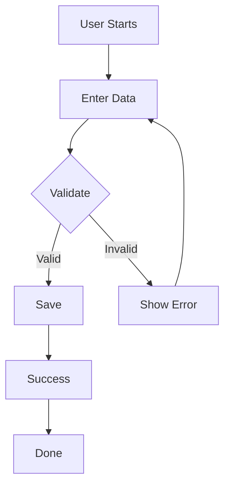
```mermaid
graph TD
    A[User Starts] --> B[Enter Data]
    B --> C{Validate}
    C -->|Valid| D[Save]
    C -->|Invalid| E[Show Error]
    E --> B
    D --> F[Success]
    F --> G[Done]
```

### Decision Point Flow
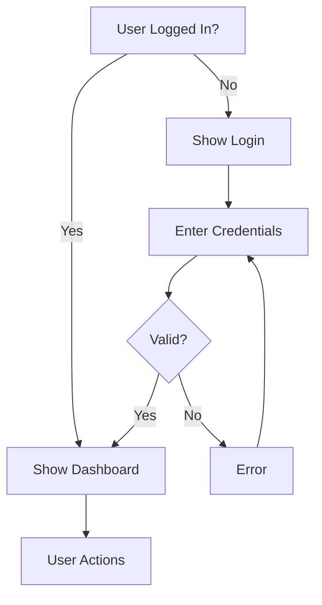
```mermaid
graph TD
    A[User Logged In?] -->|Yes| B[Show Dashboard]
    A -->|No| C[Show Login]
    B --> D[User Actions]
    C --> E[Enter Credentials]
    E --> F{Valid?}
    F -->|Yes| B
    F -->|No| G[Error]
    G --> E
```

### Multi-Path Flow
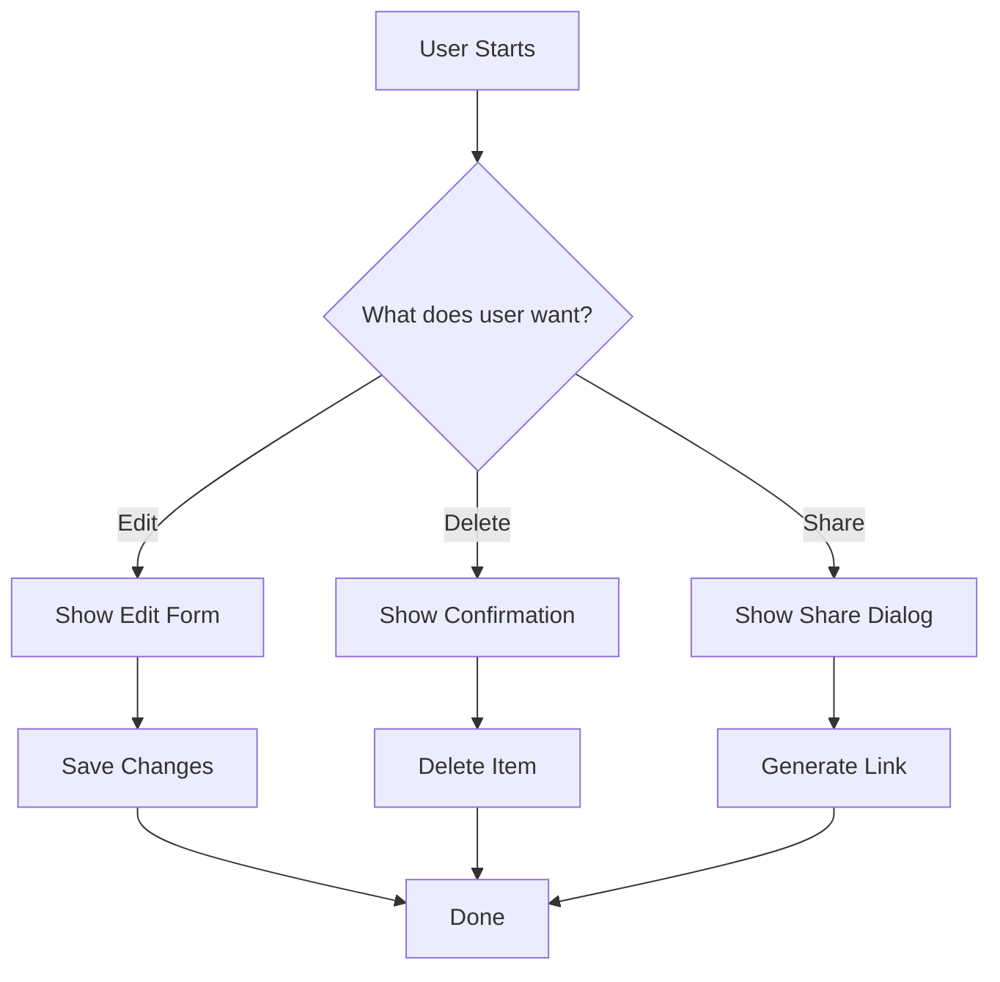
```mermaid
graph TD
    A[User Starts] --> B{What does user want?}
    B -->|Edit| C[Show Edit Form]
    B -->|Delete| D[Show Confirmation]
    B -->|Share| E[Show Share Dialog]
    C --> F[Save Changes]
    D --> G[Delete Item]
    E --> H[Generate Link]
    F --> I[Done]
    G --> I
    H --> I
```

### Error Recovery Flow
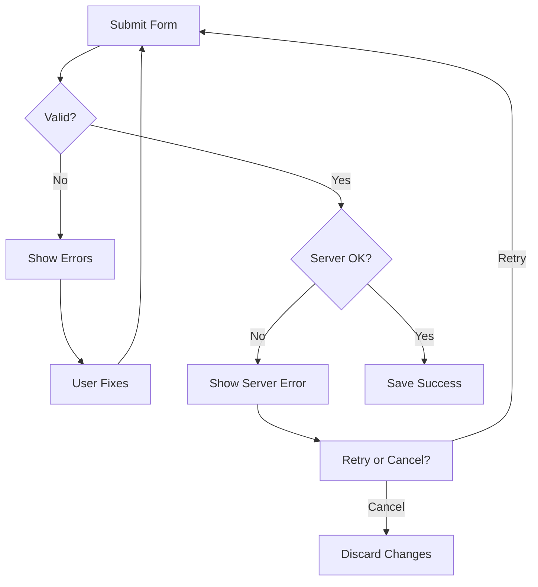
```mermaid
graph TD
    A[Submit Form] --> B{Valid?}
    B -->|No| C[Show Errors]
    C --> D[User Fixes]
    D --> A
    B -->|Yes| E{Server OK?}
    E -->|No| F[Show Server Error]
    F --> G[Retry or Cancel?]
    G -->|Retry| A
    G -->|Cancel| H[Discard Changes]
    E -->|Yes| I[Save Success]
```

### State-Based Flow
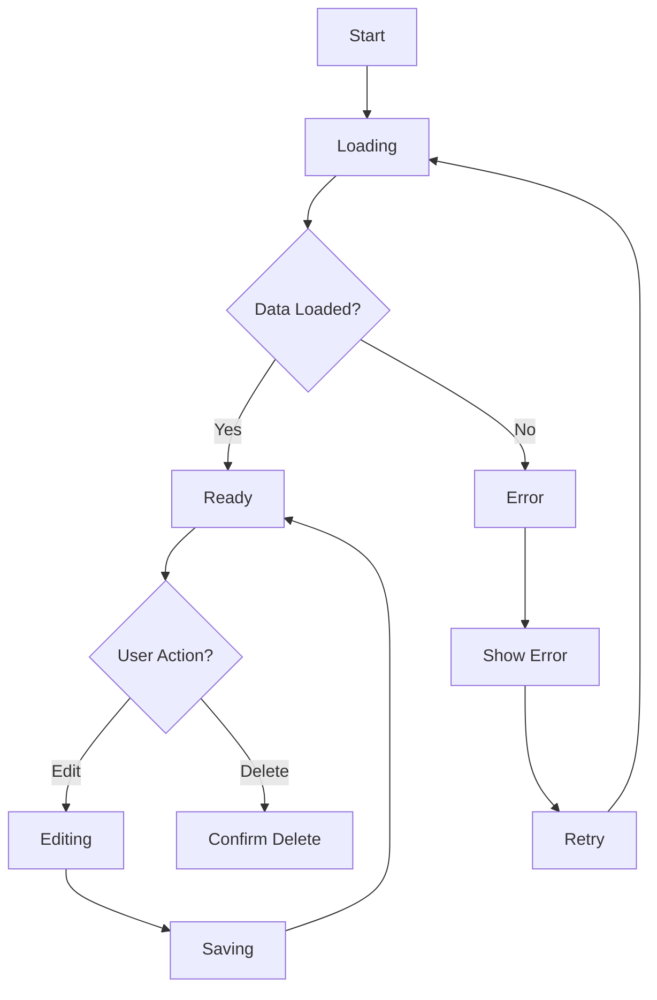
```mermaid
graph TD
    A[Start] --> B[Loading]
    B --> C{Data Loaded?}
    C -->|Yes| D[Ready]
    C -->|No| E[Error]
    D --> F{User Action?}
    F -->|Edit| G[Editing]
    F -->|Delete| H[Confirm Delete]
    G --> I[Saving]
    I --> D
    E --> J[Show Error]
    J --> K[Retry]
    K --> B
```

### Loop and Retry
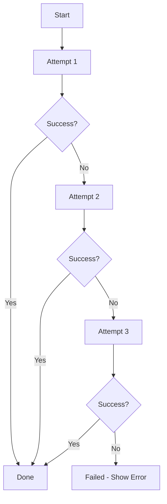
```mermaid
graph TD
    A[Start] --> B[Attempt 1]
    B --> C{Success?}
    C -->|Yes| D[Done]
    C -->|No| E[Attempt 2]
    E --> F{Success?}
    F -->|Yes| D
    F -->|No| G[Attempt 3]
    G --> H{Success?}
    H -->|Yes| D
    H -->|No| I[Failed - Show Error]
```

## Sequence Diagram Examples

### User to System
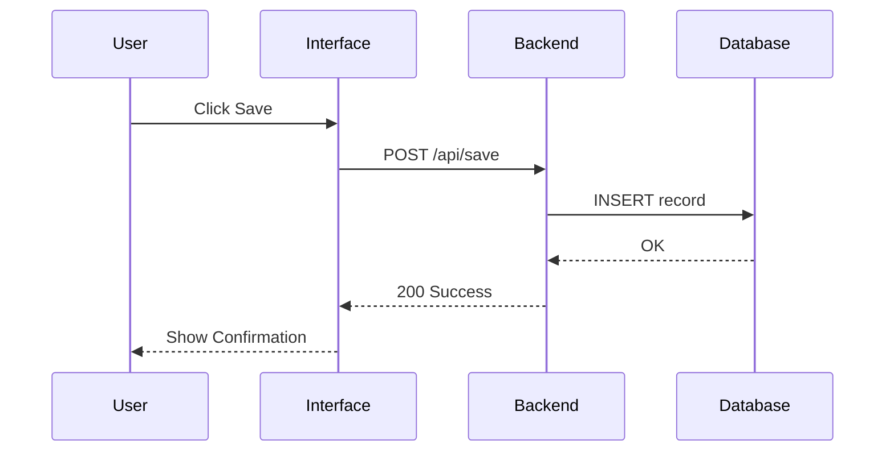
```mermaid
sequenceDiagram
    User->>Interface: Click Save
    Interface->>Backend: POST /api/save
    Backend->>Database: INSERT record
    Database-->>Backend: OK
    Backend-->>Interface: 200 Success
    Interface-->>User: Show Confirmation
```

### Multi-Step Interaction
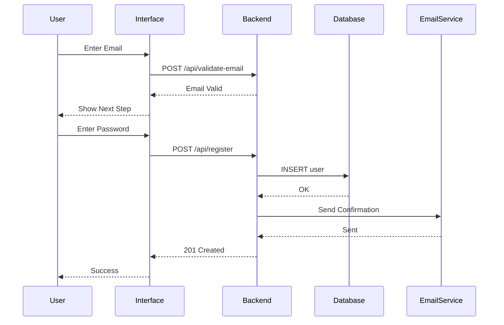
```mermaid
sequenceDiagram
    User->>Interface: Enter Email
    Interface->>Backend: POST /api/validate-email
    Backend-->>Interface: Email Valid
    Interface-->>User: Show Next Step
    User->>Interface: Enter Password
    Interface->>Backend: POST /api/register
    Backend->>Database: INSERT user
    Database-->>Backend: OK
    Backend->>EmailService: Send Confirmation
    EmailService-->>Backend: Sent
    Backend-->>Interface: 201 Created
    Interface-->>User: Success
```

### Error Handling Sequence
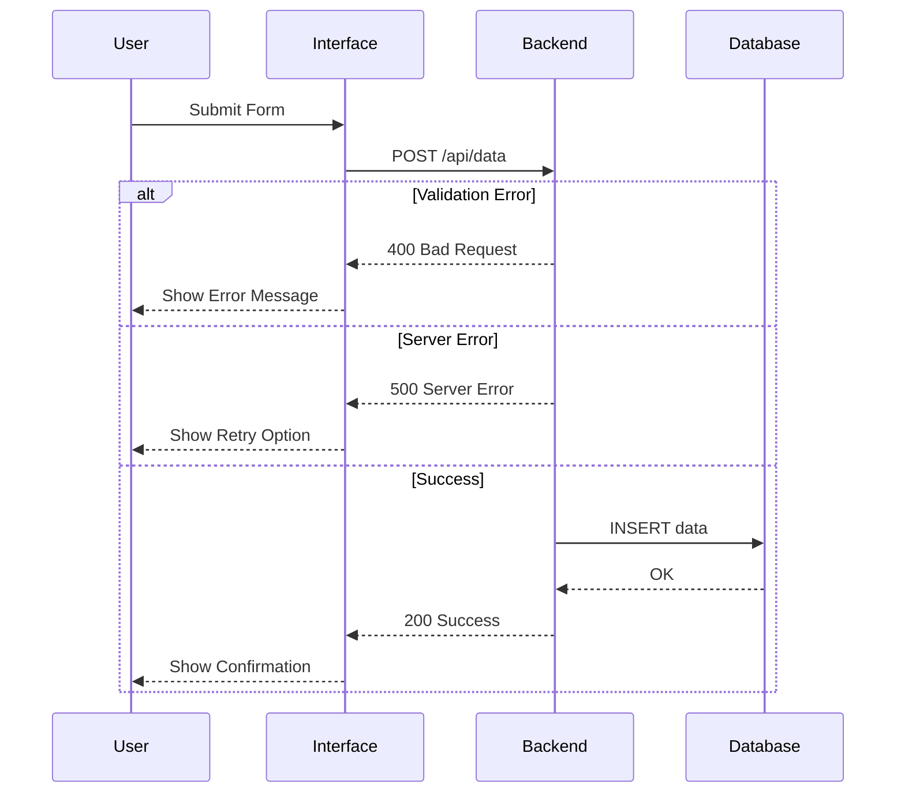
```mermaid
sequenceDiagram
    User->>Interface: Submit Form
    Interface->>Backend: POST /api/data
    alt Validation Error
        Backend-->>Interface: 400 Bad Request
        Interface-->>User: Show Error Message
    else Server Error
        Backend-->>Interface: 500 Server Error
        Interface-->>User: Show Retry Option
    else Success
        Backend->>Database: INSERT data
        Database-->>Backend: OK
        Backend-->>Interface: 200 Success
        Interface-->>User: Show Confirmation
    end
```

### Async Operation
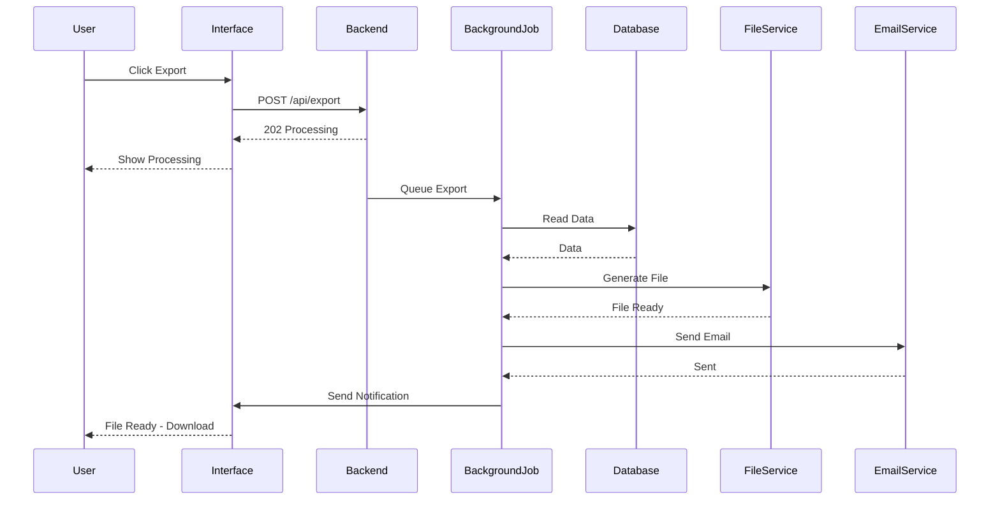
```mermaid
sequenceDiagram
    User->>Interface: Click Export
    Interface->>Backend: POST /api/export
    Backend-->>Interface: 202 Processing
    Interface-->>User: Show Processing
    Backend->>BackgroundJob: Queue Export
    BackgroundJob->>Database: Read Data
    Database-->>BackgroundJob: Data
    BackgroundJob->>FileService: Generate File
    FileService-->>BackgroundJob: File Ready
    BackgroundJob->>EmailService: Send Email
    EmailService-->>BackgroundJob: Sent
    BackgroundJob->>Interface: Send Notification
    Interface-->>User: File Ready - Download
```

### API Error Flow
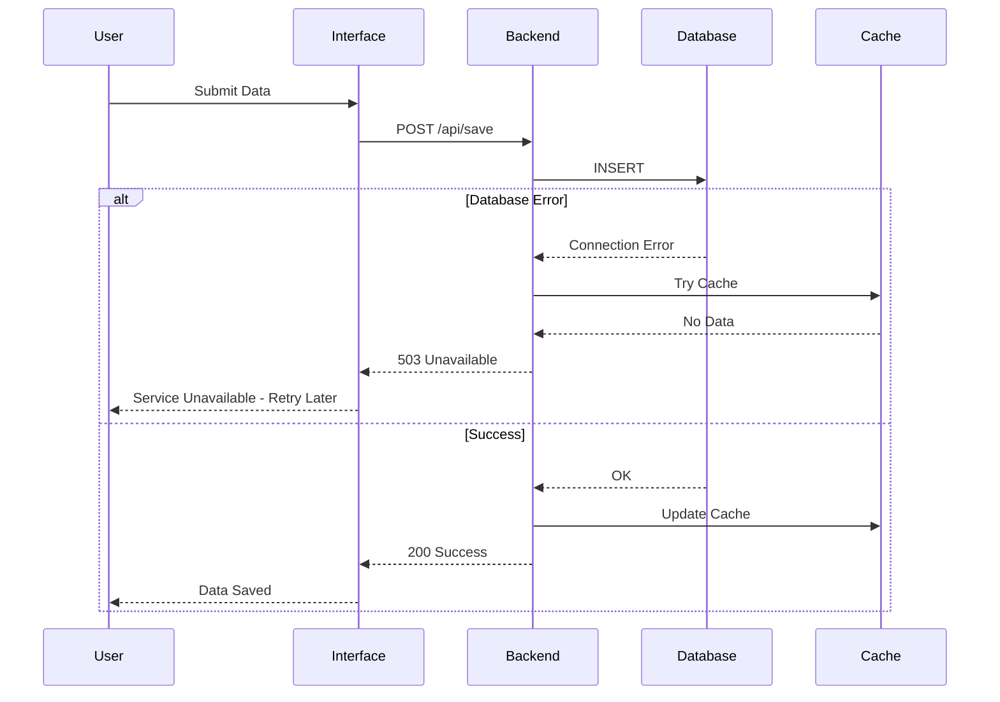
```mermaid
sequenceDiagram
    User->>Interface: Submit Data
    Interface->>Backend: POST /api/save
    Backend->>Database: INSERT
    alt Database Error
        Database-->>Backend: Connection Error
        Backend->>Cache: Try Cache
        Cache-->>Backend: No Data
        Backend-->>Interface: 503 Unavailable
        Interface-->>User: Service Unavailable - Retry Later
    else Success
        Database-->>Backend: OK
        Backend->>Cache: Update Cache
        Backend-->>Interface: 200 Success
        Interface-->>User: Data Saved
    end
```

## State Chart Examples

### Simple State Machine
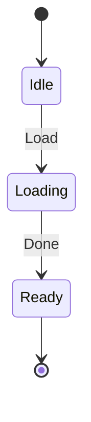
```mermaid
stateDiagram-v2
    [*] --> Idle
    Idle --> Loading: Load
    Loading --> Ready: Done
    Ready --> [*]
```

### User Authentication Flow
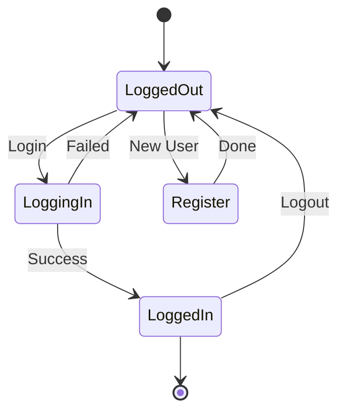
```mermaid
stateDiagram-v2
    [*] --> LoggedOut
    LoggedOut --> LoggingIn: Login
    LoggingIn --> LoggedIn: Success
    LoggingIn --> LoggedOut: Failed
    LoggedOut --> Register: New User
    Register --> LoggedOut: Done
    LoggedIn --> LoggedOut: Logout
    LoggedIn --> [*]
```

### Form Editing Flow
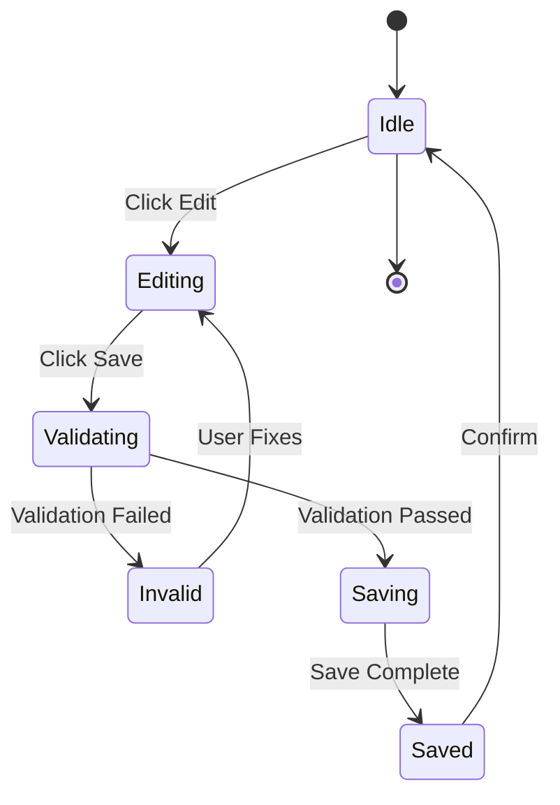
```mermaid
stateDiagram-v2
    [*] --> Idle
    Idle --> Editing: Click Edit
    Editing --> Validating: Click Save
    Validating --> Invalid: Validation Failed
    Invalid --> Editing: User Fixes
    Validating --> Saving: Validation Passed
    Saving --> Saved: Save Complete
    Saved --> Idle: Confirm
    Idle --> [*]
```

### Data Processing States
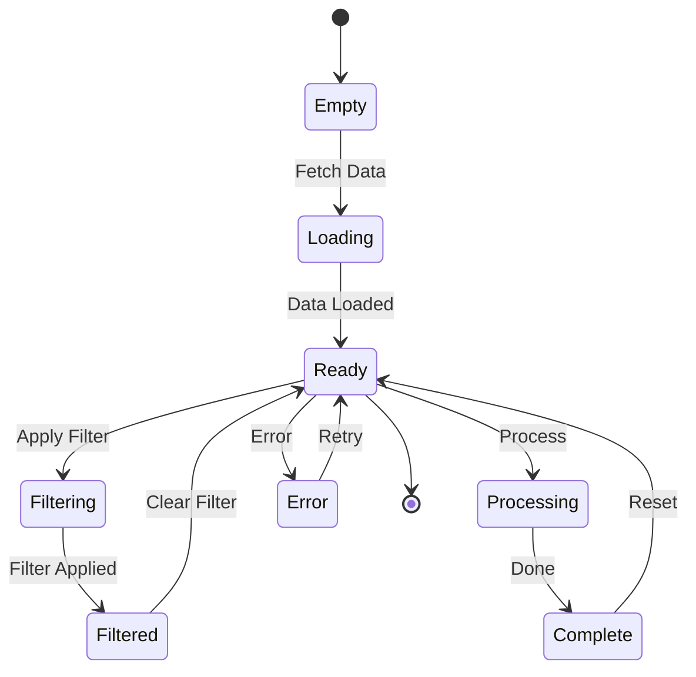
```mermaid
stateDiagram-v2
    [*] --> Empty
    Empty --> Loading: Fetch Data
    Loading --> Ready: Data Loaded
    Ready --> Filtering: Apply Filter
    Filtering --> Filtered: Filter Applied
    Filtered --> Ready: Clear Filter
    Ready --> Processing: Process
    Processing --> Complete: Done
    Complete --> Ready: Reset
    Ready --> Error: Error
    Error --> Ready: Retry
    Ready --> [*]
```

### E-Commerce Order Flow
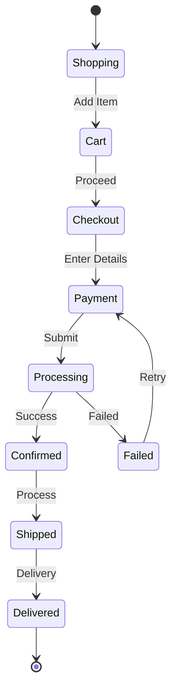
```mermaid
stateDiagram-v2
    [*] --> Shopping
    Shopping --> Cart: Add Item
    Cart --> Checkout: Proceed
    Checkout --> Payment: Enter Details
    Payment --> Processing: Submit
    Processing --> Confirmed: Success
    Processing --> Failed: Failed
    Failed --> Payment: Retry
    Confirmed --> Shipped: Process
    Shipped --> Delivered: Delivery
    Delivered --> [*]
```

### Complex State Machine
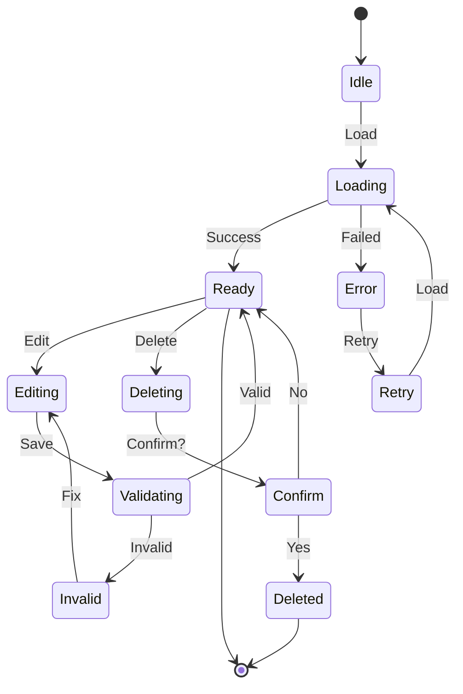
```mermaid
stateDiagram-v2
    [*] --> Idle
    
    Idle --> Loading: Load
    Loading --> Ready: Success
    Loading --> Error: Failed
    
    Ready --> Editing: Edit
    Editing --> Validating: Save
    Validating --> Ready: Valid
    Validating --> Invalid: Invalid
    Invalid --> Editing: Fix
    
    Ready --> Deleting: Delete
    Deleting --> Confirm: Confirm?
    Confirm --> Deleted: Yes
    Confirm --> Ready: No
    
    Error --> Retry: Retry
    Retry --> Loading: Load
    
    Ready --> [*]
    Deleted --> [*]
```

## Entity Relationship Diagram

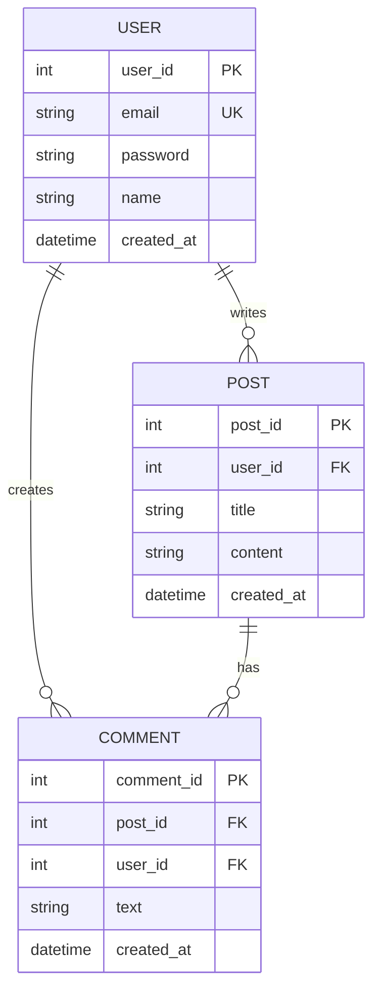
```mermaid
erDiagram
    USER ||--o{ POST : writes
    USER ||--o{ COMMENT : creates
    POST ||--o{ COMMENT : has
    USER {
        int user_id PK
        string email UK
        string password
        string name
        datetime created_at
    }
    POST {
        int post_id PK
        int user_id FK
        string title
        string content
        datetime created_at
    }
    COMMENT {
        int comment_id PK
        int post_id FK
        int user_id FK
        string text
        datetime created_at
    }
```

## Class Diagram

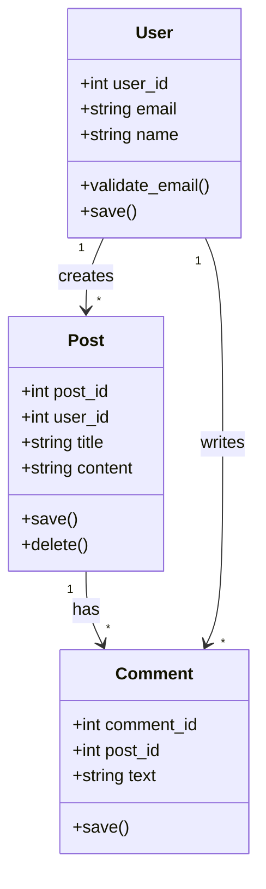
```mermaid
classDiagram
    class User {
        +int user_id
        +string email
        +string name
        +validate_email()
        +save()
    }
    class Post {
        +int post_id
        +int user_id
        +string title
        +string content
        +save()
        +delete()
    }
    class Comment {
        +int comment_id
        +int post_id
        +string text
        +save()
    }
    User "1" --> "*" Post : creates
    Post "1" --> "*" Comment : has
    User "1" --> "*" Comment : writes
```

## Gantt Diagram (Timeline)

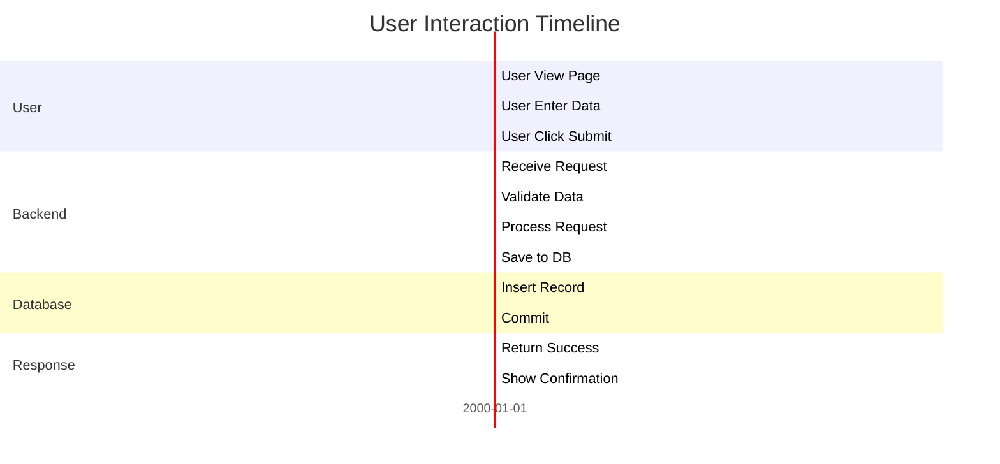
```mermaid
gantt
    title User Interaction Timeline
    
    section User
    User View Page: u1, 0, 1
    User Enter Data: u2, after u1, 2
    User Click Submit: u3, after u2, 1
    
    section Backend
    Receive Request: b1, after u3, 1
    Validate Data: b2, after b1, 1
    Process Request: b3, after b2, 2
    Save to DB: b4, after b3, 1
    
    section Database
    Insert Record: db1, after b4, 1
    Commit: db2, after db1, 1
    
    section Response
    Return Success: r1, after db2, 1
    Show Confirmation: r2, after r1, 1
```

## Tips for Each Diagram Type

### Flowchart
- Use clear labels on each box
- Use descriptive decision text
- Show all paths
- Include error paths
- Avoid too much nesting

### Sequence Diagram
- Show time flowing downward
- Include all actors (user, system, services)
- Show request/response pairs
- Include error cases (alt blocks)
- Keep sequence straightforward

### State Chart
- Define all valid states clearly
- Show all transitions
- Use clear transition labels
- Include start [*] and end [*]
- Avoid too many states

### Entity Relationship
- Show all entities
- Define primary keys (PK)
- Show foreign keys (FK)
- Define relationships (1:1, 1:n, etc)
- Include key attributes

### Class Diagram
- Show attributes and methods
- Use correct access modifiers
- Show relationships
- Include multiplicities
- Keep organized

## Using These Patterns

### When Creating Diagrams

1. **Identify diagram type** - What do you want to show?
2. **Choose pattern** - Which pattern matches your need?
3. **Adapt to your domain** - Change names and labels
4. **Include all cases** - Normal, error, edge cases
5. **Validate** - Does it show what you need?

### For Reviews

Use these patterns to document:
- **Flowchart** - All possible user paths
- **Sequence** - System interactions step by step
- **State Chart** - Valid states and transitions
- **Entity** - Data structures and relationships
- **Class** - System architecture

---

**Copy and adapt these patterns for your specific designs and requirements.**
