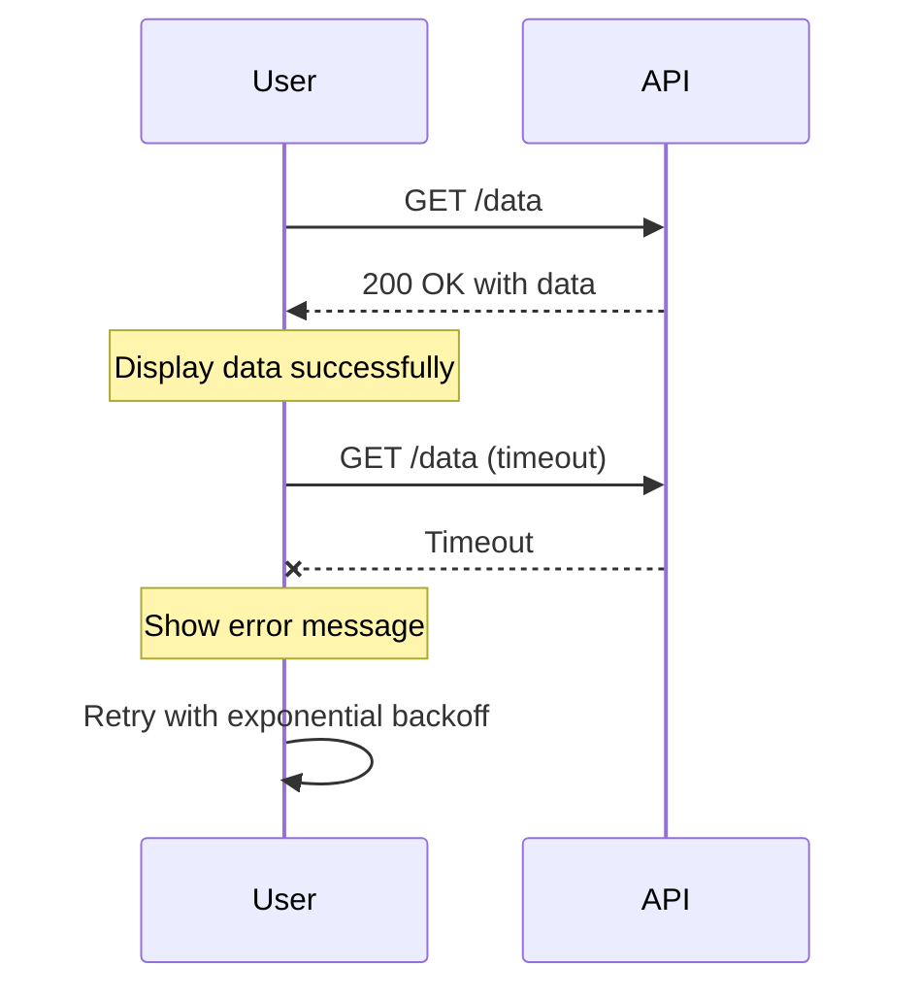
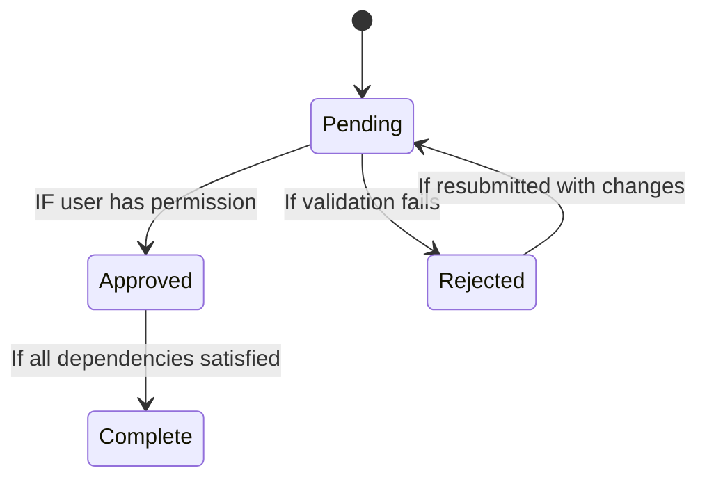
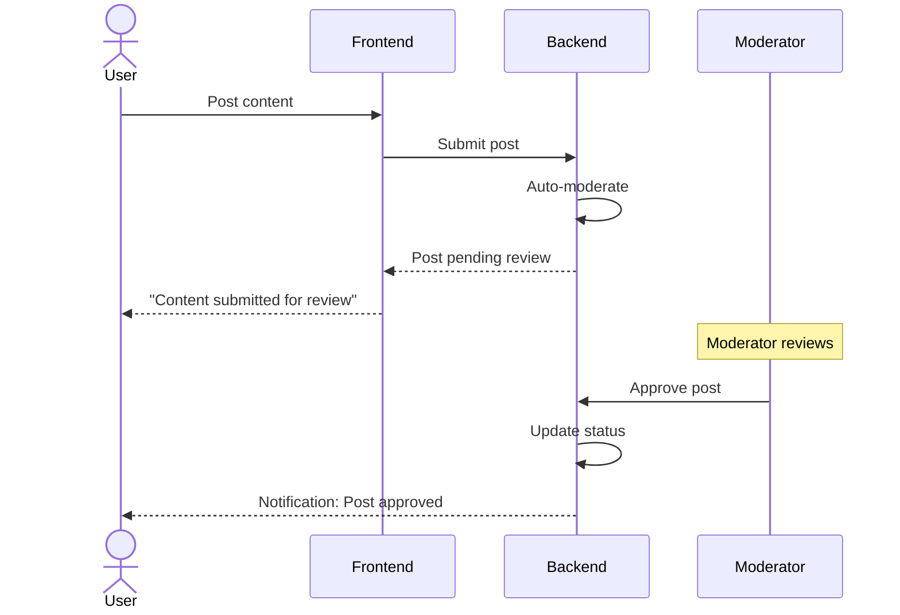
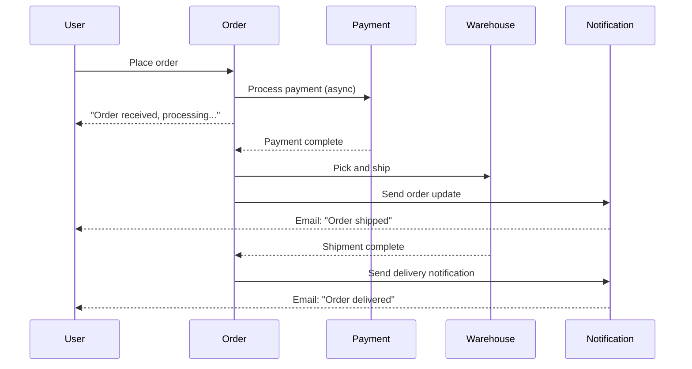
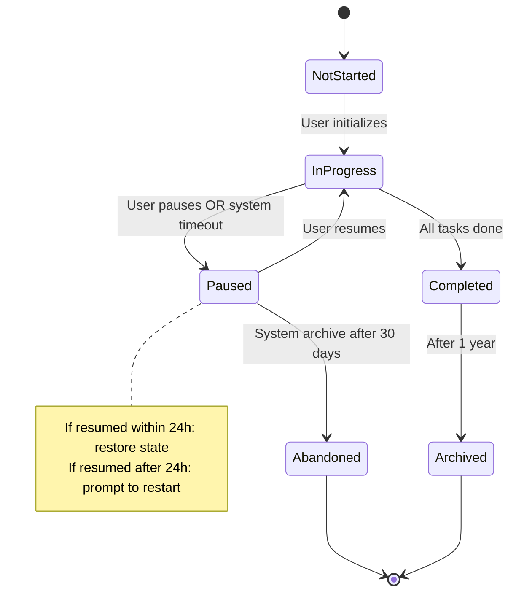

# Mermaid Diagram Patterns for Product Specifications

## When to Use Each Diagram Type

### User Journey Diagram
**Use for**: Visualizing the complete experience from a user's perspective, including emotions, pain points, and touchpoints.

**Best for**: Understanding the holistic flow, identifying where users succeed or struggle, documenting the "why" behind each step.

**Avoid for**: Technical system flows (use Sequence Diagram); state transitions (use State Chart); branching logic alone (use Flowchart).

**Example structure**:
```
Journey title: User Signs Up for App
  section Discovery
    User sees ad: 5: User
    User visits site: 5: User
    Learns features: 4: User
  section Signup
    Fills form: 4: User
    Verifies email: 3: User
  section First Use
    Creates first item: 5: User
    Completes tutorial: 4: User
```

### Sequence Diagram
**Use for**: Multi-step interactions between actors (users, frontend, backend, external services) showing order and dependencies.

**Best for**: API flows, payment processing, integrations, multi-actor workflows where timing matters.

**Avoid for**: Single-component flows (use Flowchart); state-only transitions (use State Chart).

**Example structure**:
```
sequenceDiagram
    User->>Frontend: Submit payment form
    Frontend->>Backend: POST /checkout
    Backend->>PaymentService: Charge card
    PaymentService-->>Backend: Success/Decline
    Backend->>Database: Create order
    Backend-->>Frontend: Order confirmed
    Frontend-->>User: Show confirmation screen
```

### State Chart
**Use for**: All possible states of an entity and the valid transitions between them, including error states.

**Best for**: Understanding what states something can be in, what triggers transitions, and what's invalid.

**Avoid for**: User experience (use User Journey); multi-actor timing (use Sequence Diagram); simple logic (use Flowchart).

**Example structure**:
```
stateDiagram-v2
    [*] --> Unpublished
    Unpublished --> Draft: Author starts writing
    Draft --> Published: Author publishes
    Draft --> Rejected: Editor rejects
    Published --> Archived: Author archives
    Rejected --> Draft: Author revises
    Archived --> [*]
```

### Flowchart
**Use for**: Decision trees, conditional logic, and process flows with branching.

**Best for**: "If this, then that" logic, approval workflows, routing decisions.

**Avoid for**: Multi-actor interactions (use Sequence); state definitions (use State Chart).

**Example structure**:
```
flowchart TD
    A[User enters email] --> B{Email valid?}
    B -->|No| C[Show error]
    C --> A
    B -->|Yes| D{Account exists?}
    D -->|Yes| E[Show login screen]
    D -->|No| F[Create account]
```

## Diagram Patterns for Common Scenarios

### Pattern 1: Happy Path + Error Recovery

**Challenge**: Show the success case and what happens when it fails, without making the diagram unreadable.

**Solution**: Use sequence diagram with explicit error branches.



### Pattern 2: State Transitions with Guards

**Challenge**: Show which transitions are valid in which states; make invalid transitions obvious.

**Solution**: Use state chart with conditional labels.



### Pattern 3: Multi-Role Workflows

**Challenge**: Show parallel or sequential actions by different roles without confusion.

**Solution**: Use sequence diagram with clear role labels and timing notes.



### Pattern 4: Async/Event-Driven Flows

**Challenge**: Show actions that happen asynchronously or out of order.

**Solution**: Use sequence diagram with explicit timing and notification flows.



### Pattern 5: State Machine with Complex Conditions

**Challenge**: Show conditional transitions without the diagram becoming unreadable.

**Solution**: Simplify by grouping related states; link to detailed specifications.



## Diagram Quality Checklist

### Completeness
- [ ] Does the diagram include the happy path AND failure paths?
- [ ] Are all actors or components shown?
- [ ] Are all decision points labeled?
- [ ] Are all error states or exception cases documented?

### Clarity
- [ ] Can a builder read this and understand the flow without guessing?
- [ ] Are labels precise? ("Send email" not "Notify"; "3-second timeout" not "wait")
- [ ] Is the flow left-to-right or top-to-bottom, consistently?
- [ ] Do colors or grouping help orient the reader?

### Accuracy
- [ ] Does this match the written specification?
- [ ] Are there any ambiguous transitions or states?
- [ ] Are preconditions for transitions explicit?

### Simplicity
- [ ] Is the diagram serving a clear purpose, or is it trying to document everything?
- [ ] Could it be split into multiple focused diagrams?
- [ ] Are edge cases documented separately if the diagram is getting crowded?

## Common Diagram Pitfalls

### Pitfall 1: The Undocumented Arrow
**Problem**: Transition exists but condition isn't shown.
**Example**: State A transitions to State B, but nothing says when.
**Fix**: Label every transition with the trigger. "User clicks submit," "Validation passes," "Timeout after 5 min."

### Pitfall 2: The Invisible Error
**Problem**: Only happy path is shown.
**Example**: Sequence shows the success API call, no failure response.
**Fix**: Add error cases explicitly. Show what happens if the API returns 400, 500, timeout.

### Pitfall 3: The Ambiguous Actor
**Problem**: Multiple components but it's unclear which is responsible.
**Example**: "User is notified" but not through which channel or system.
**Fix**: Be specific. "Frontend shows toast to user," not just "user is notified."

### Pitfall 4: The Ghost State
**Problem**: Diagram implies a state that isn't explicitly named.
**Example**: State chart missing the "loading" or "error" state.
**Fix**: Make all intermediate and error states explicit.

### Pitfall 5: The Unguarded Transition
**Problem**: State can transition but the condition is obvious or missing.
**Example**: Pending → Approved, but who can approve? Do they need permission?
**Fix**: Guard transitions explicitly. "Pending → Approved [IF user is Admin AND validation passes]"

## Workflow: Creating Effective Diagrams

1. **List all actors/components** involved in this flow
2. **Identify the starting state/event**: What triggers this?
3. **Trace the happy path**: From start to success, what are the steps?
4. **Add decision points**: Where does the flow branch?
5. **Add error paths**: For each step, what can go wrong?
6. **Name states/actors clearly**: Use terms from your specification consistently
7. **Label transitions**: Every arrow should have a trigger or condition
8. **Validate against spec**: Does the diagram match what you've documented in prose?
9. **Test readability**: Can someone unfamiliar with this flow understand it?

## Examples by Domain

### E-commerce: Order Fulfillment
Use Sequence Diagram to show: User → Frontend → Backend → Payment → Inventory → Shipping → Notification

### SaaS: Account Creation & Onboarding
Use User Journey Diagram for emotional arc; Sequence Diagram for multi-system flow; State Chart for account states

### Marketplace: Content Moderation
Use Sequence Diagram for multi-actor approval flows; State Chart for content lifecycle (submitted → approved/rejected → published/removed)

### Workflow/Automation: Task Management
Use State Chart for task states; Flowchart for conditional routing; Sequence Diagram for multi-user collaboration
